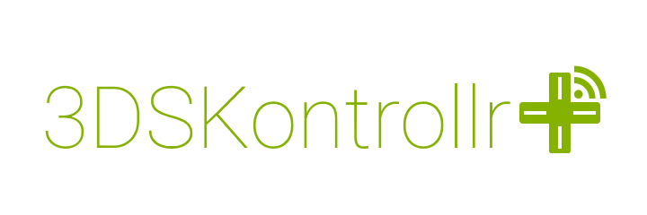

# Control your PC using your Nintendo 3DS.

**NOTE: THIS IS IN A VERY EARLY STAGE OF DEVELOPMENT. IT'S FUNCTIONAL, BUT MOST THINGS ARE HARDCODED RIGHT NOW**

This is the repository for the Homebrew client of 3DSKontrollr+

These are just the lua files, to run them on your console, you'll need [ctrµLua](https://github.com/ctruLua/ctruLua).

This is not a new concept, in fact i did the [exact same thing](https://github.com/TheBITLINK/3DSKontrollrLegacy)
 last year, but using just the default system browser and some JavaScript tricks. It was obviously, very limited.

This is a rewrite from scratch of both the server software, and the client app, which now has full access to the console input, since it's homebrew. There will still be browser support, but the focus now is the homebrew app.

As i said before, the app it's (kinda) functional in its current state, but a lot of thing are hardcoded for now. If you still want to check it out, follow these steps:

 - Download the latest build of [ctrµLua](https://github.com/ctruLua/ctruLua).
 - Clone/Download this repository.
 - Edit `Screens/test.lua` and change `local serverIp = "192.168.0.106"` to the IP of your computer.
 - Put ctrµLua in the root of the repo directory, and copy it to your SD card, under the `/3ds/` folder.
 - Clone the [server repository](https://github.com/3DSKontrollr/3DSKServer).
 - Install [ScpServer](http://forums.pcsx2.net/Thread-XInput-Wrapper-for-DS3-and-Play-com-USB-Dual-DS2-Controller) or [ScpToolkit](https://github.com/nefarius/ScpToolkit) (this is needed for Xbox Controller emulation).
 - Under the server repository, in `3DSKTestApp/Program.cs`, change `Address = IPAddress.Parse("192.168.0.101"),` to the IP address of your console.
 - Compile and run `3DSKTestApp` on your PC.
 - On your console, open the homebrew launcher and launch ctrµLua.
 - Input on your console now should be forwarded to a virtual XInput device on your PC. The volume slider should control the PC volume as well.

## Why ctrµLua?
I used Lua in first place because i'm not good with C (yeah, make fun of me).

The most popular choice for programming 3ds homebrew in lua is [LPP](https://github.com/Rinnegatamante/lpp-3ds). However there are some good reasons i decided to use ctrµLua:
 - **The API is more organised**: Not only it has a good documentation (unlike LPP which is a mess), but it puts everything in modules, and i feel at home using `require` to import only what i need, just like in nodejs.
 - **It's more inclined to Object Oriented Programming**: While in LPP methods like `Screen.loadImage` returns an id, which you have to include as a parameter in every draw method, the ctrµLua equivalent (`ctr.gfx.texture.load`) returns a table, which contains all the methods you need, and you can directly do stuff with it, ie. `tex:draw(x,y)`.
 - **It has UDP support**: This is the most important point. UDP is important since this little bitch sends a lot of data over the network, and TCP is unreliable for sending input data in real time. Sure, [TCP is broken right now](https://github.com/ctruLua/ctruLua/issues/10), but i can deal with that.

So if you haven't tried ctrµLua, you must do it. Right now. Okno, but seriously, they deserve more attention.
